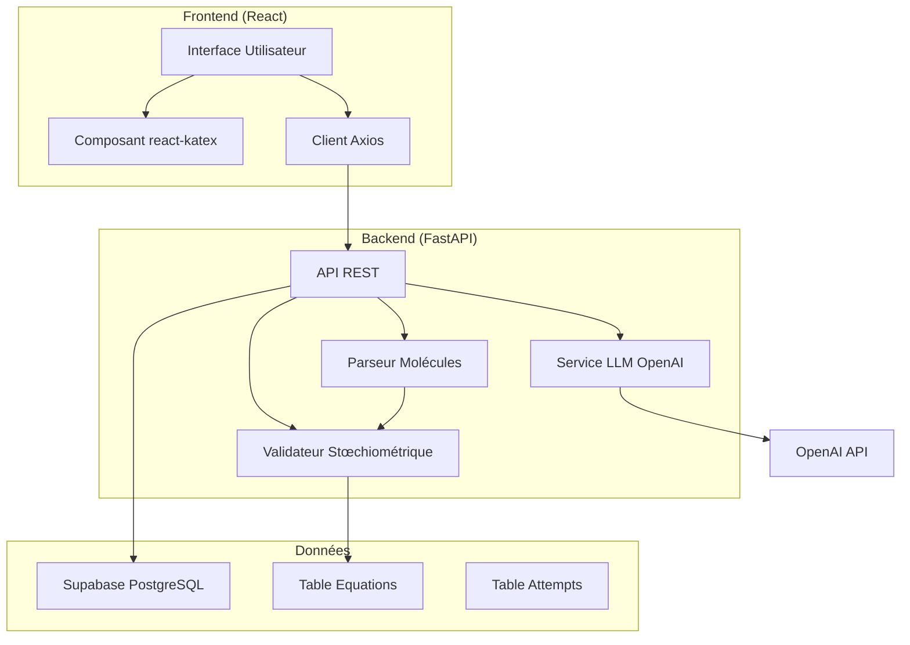

# Plan Prototype Chem-Balancer

## 1. Objectif du Prototype

Prototype minimal fonctionnel pour valider le concept d'un STI (Système Tutoriel Intelligent) d'aide à la résolution d'équations chimiques, combinant:
- Un moteur de parsing et validation stœchiométrique
- Un backend FastAPI avec intégration LLM (OpenAI)
- Un frontend React avec rendu chimique professionnel

---

## 2. Architecture Système



---

## 3. Structure des Répertoires

```
chem-balancer/
├── backend/
│   ├── app/
│   │   ├── __init__.py
│   │   ├── main.py              # Point d'entrée FastAPI
│   │   ├── config.py            # Variables d'environnement
│   │   ├── models/
│   │   │   ├── __init__.py
│   │   │   └── chemistry.py     # Classes Molecule, Atom
│   │   ├── schemas/
│   │   │   ├── __init__.py
│   │   │   └── schemas.py       # Schémas Pydantic
│   │   ├── api/
│   │   │   ├── __init__.py
│   │   │   └── endpoints.py     # Routes API
│   │   └── services/
│   │       ├── __init__.py
│   │       ├── llm_service.py   # Appel OpenAI
│   │       └── chemistry_service.py  # Logique parsing/validation
│   ├── tests/
│   │   └── test_chemistry.py
│   ├── .env.example
│   ├── requirements.txt
│   └── Dockerfile
│
├── frontend/
│   ├── src/
│   │   ├── components/
│   │   │   ├── chemistry/
│   │   │   │   ├── MoleculeDisplay.jsx
│   │   │   │   └── EquationDisplay.jsx
│   │   │   ├── ExerciseInterface.jsx
│   │   │   └── FeedbackPanel.jsx
│   │   ├── pages/
│   │   │   ├── LoginPage.jsx
│   │   │   └── ExercisePage.jsx
│   │   ├── context/
│   │   │   └── ExerciseContext.jsx
│   │   ├── services/
│   │   │   └── api.js
│   │   ├── App.jsx
│   │   ├── main.jsx
│   │   └── index.css
│   ├── public/
│   ├── index.html
│   ├── package.json
│   ├── vite.config.js
│   └── .env.example
│
└── docker-compose.yml
```

---

## 4. Spécifications Backend

### 4.1 Parsing des Molécules

**Classe `Atom`:**
```python
class Atom:
    symbol: str      # Ex: "H", "O", "Fe"
    count: int       # Nombre d'atomes
```

**Classe `Molecule`:**
```python
class Molecule:
    formula: str                    # Formule brute: "H2O", "Fe2(SO4)3"
    atoms: dict[str, int]           # Dénombrement: {"H": 2, "O": 1}
    coefficient: int = 1            # Coefficient stœchiométrique
    
    def parse(formula: str) -> Molecule
    def get_total_atoms() -> dict[str, int]  # Atomes * coefficient
```

**Règles de parsing:**
- Gérer les indices: `H2O` → H:2, O:1
- Gérer les parenthèses: `Fe2(SO4)3` → Fe:2, S:3, O:12
- Gérer les coefficients implicites: coefficient = 1 si absent

### 4.2 Validation Stoechiométrique

**Endpoint `POST /api/validate`:**
```json
// Request
{
  "equation": {
    "reactants": [
      {"formula": "H2", "coefficient": 2},
      {"formula": "O2", "coefficient": 1}
    ],
    "products": [
      {"formula": "H2O", "coefficient": 2}
    ]
  }
}

// Response (succès)
{
  "balanced": true,
  "message": "Équation correctement équilibrée!"
}

// Response (erreur)
{
  "balanced": false,
  "errors": [
    {"element": "O", "reactant_count": 2, "product_count": 2, "diff": 0},
    {"element": "H", "reactant_count": 4, "product_count": 4, "diff": 0}
  ],
  "message": "L'équation est équilibrée."
}
```

### 4.3 Service LLM pour les Indices

**Endpoint `POST /api/hint`:**
```json
// Request
{
  "equation": {...},
  "user_level": "débutant",
  "current_attempt": {...},
  "error_detail": "Il manque 1 atome d'Oxygène du côté des produits"
}

// Response
{
  "hint": "Observe bien le côté droit de l'équation. Combien d'atomes d'oxygène y a-t-il actuellement dans H2O ? Et combien en faut-il pour matcher les réactifs ?",
  "hint_level": 1
}
```

**Prompt System:**
```
Tu es un tuteur en chimie bienveillant et expert. Tu aides un étudiant à équilibrer une équation chimique.
RÈGLES ABSOLUES:
1. Ne donne JAMAIS la réponse directe
2. Guide par des questions et indices
3. Adapte ton langage au niveau (débutant = simple, avancé = technique)
4. Référence toujours la loi de conservation de la masse de Lavoisier
```

---

## 5. Spécifications Frontend

### 5.1 Composant MoleculeDisplay

```jsx
// Utilisation de react-katex
import { InlineMath } from 'react-katex';

// Rendu de H2SO4 avec indices corrects
<InlineMath math="H_2SO_4" />  // Affiche H₂SO₄
```

### 5.2 Interface d'Exercise

```
┌─────────────────────────────────────────────────────────┐
│  Équation 1/10                    ⏱️ 05:32             │
├─────────────────────────────────────────────────────────┤
│                                                         │
│    [ 2 ] H₂  +  [ 1 ] O₂  →  [ 2 ] H₂O                 │
│                                                         │
│    ┌─────────────────────────────────────────────┐     │
│    │ Saisissez les coefficients stœchiométriques │     │
│    └─────────────────────────────────────────────┘     │
│                                                         │
│         [ Vérifier ]    [ Demander un indice ]         │
│                                                         │
├─────────────────────────────────────────────────────────┤
│  💬 Tutor: "Très bien ! L'équation est équilibrée."    │
└─────────────────────────────────────────────────────────┘
```

### 5.3 États de l'Interface

- **État initial:** Coefficients à 1, champs vides
- **En cours:** Modification des coefficients, chronomètre actif
- **Succès:** Feedback positif, bouton "Équation suivante"
- **Erreur:** Message d'erreur détaillé, suggestion d'indice

---

## 6. Stack Technique

| Composant | Technologie | Version |
|-----------|-------------|---------|
| Backend | FastAPI | 0.109+ |
| Python | Python | 3.11+ |
| Validation | Pydantic | 2.0+ |
| LLM | OpenAI API | gpt-4 |
| Frontend | React | 18+ |
| Build | Vite | 5+ |
| Math | react-katex | 3.7+ |
| HTTP | Axios | 1.6+ |
| Database | Supabase | PostgreSQL |

---

## 7. Étapes d'Implémentation

### Phase 1: Backend Core
1. Créer structure projet FastAPI
2. Implémenter `chemistry.py` (parsing molécule)
3. Implémenter `chemistry_service.py` (validation)
4. Créer endpoints `/validate` et `/hint`
5. Implémenter `llm_service.py`
6. Tester parsing et validation

### Phase 2: Frontend Core
1. Initialiser projet React + Vite
2. Installer dépendances (react-katex, axios)
3. Créer `MoleculeDisplay.jsx`
4. Créer `ExercisePage.jsx`
5. Implémenter communication API
6. Créer `FeedbackPanel.jsx`

### Phase 3: Intégration
1. Connecter frontend ↔ backend
2. Tester flux complet
3. Valider rendu chimique
4. Tester les indices LLM

---

## 8. Points Critiques

| Priorité | Point | Description |
|----------|-------|-------------|
| 🔴 Critique | Parsing parenthèses | `Fe2(SO4)3` doit donner Fe:2, S:3, O:12 |
| 🔴 Critique | Sécurité API | Clé OpenAI uniquement côté backend |
| 🟡 Important | Rendu Katex | Formules jamais affichées en texte brut |
| 🟡 Important | Feedback LLM | Ne jamais donner la réponse directe |

---

## 9. Équations de Test

Pour valider le prototype:

| Équation | Réactifs | Produits | Solution |
|----------|----------|----------|----------|
| Eau | H₂ + O₂ | H₂O | 2,1 → 2 |
| Fer + Soufre | Fe + S | FeS | 1,1 → 1 |
| Combustion méthane | CH₄ + O₂ | CO₂ + H₂O | 1,2 → 1,2 |
| Synthèse ammoniac | N₂ + H₂ | NH₃ | 1,3 → 2 |

---

## 10. Livrables du Prototype

- [ ] Backend FastAPI fonctionnel avec endpoints `/validate` et `/hint`
- [ ] Parsing correct des formules chimiques (y compris parenthèses)
- [ ] Validation stœchiométrique avec diagnostic d'erreur
- [ ] Intégration OpenAI pour génération d'indices
- [ ] Frontend React avec rendu Katex professionnel
- [ ] Interface d'exercice interactive
- [ ] Documentation d'installation et d'utilisation